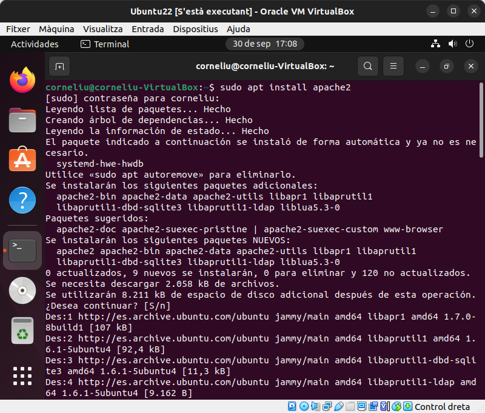
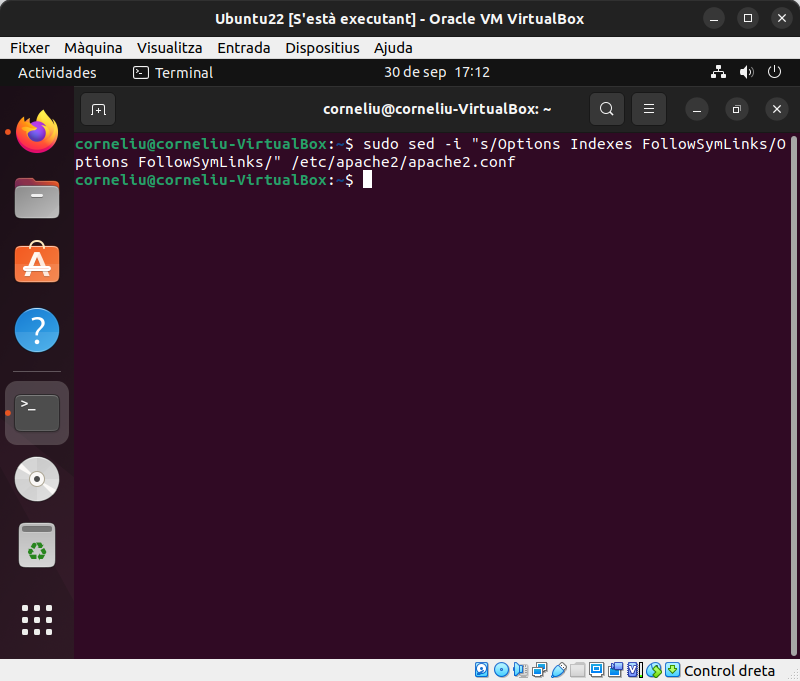
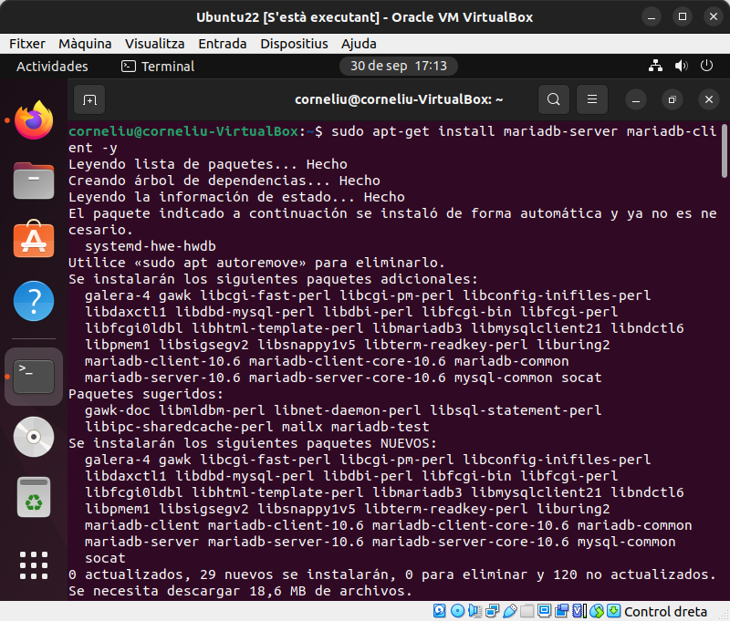
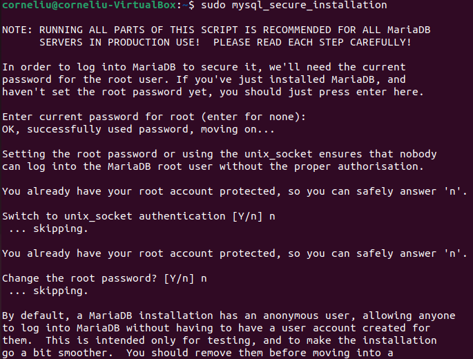

# Instal·lació d'OwnCloud

# Índex
* Introducció
* Requeriments previs
* Instal·lació d'Apache
* Instal·lació de MariaDB
* Creació de la DB d'OwnCloud
* Instal·lació de PHP i mòduls
* Instal·lació d'OwnCloud
* Configuració d'Apache
* Accedir a OwnCloud des de fora de l'equip

# Introducció

En aquesta pràctica instal·larem un servidor OwnCloud.
Owncloud és un servei d'emmagatzematge i sincronització de fitxers multiplataforma que es pot instal·lar al nostre servidor. 
Amb ell, qualsevol usuari amb un compte pot pujar informació i se sincronitzarà amb els altres usuaris a qualsevol dels seus dispositius.

# Requerimetns previs

| Plataforma | Opcions |
| ----------- | ----------- |
| Sistema operatiu | Ubuntu 20.04 LTS |
| Base de dades | MariaDB 10.5 |
| Servidor web | Apache 2.4 amb prefork i mod_php |
| PHP | 7.4 |

# Instal·lació d'Apache

Primerament instal·larem Apache, un servidor web HTTP. La funcionalitat principal d'aquest servei web és servir als usuaris tots els fitxers necessaris per visualitzar el web.

Primerament, mitjançant la comanda `sudo apt install apache2` instal·larem el servidor Apache.

Seguidament desactivem el llistat de directoris del servidor per a que no es pugui veure mitjançant la comanda : `sudo sed -i "s/Options Indexes FollowSymLinks/Options FollowSymLinks/" /etc/apache2/apache2.conf`

# Instal·lació de MariaDB

En aquest apartat instal·larem MariaDB, és una branca del sistema de gestió de bases de dades MySQL impulsada per la comunitat, per tal de mantenir el seu estat lliure sota la GNU GPL, degut a la incertesa de l'estat de la llicència de MySQL ara que està sota la propietat d'Oracle.

Per instal·lar MariaDB utilitzarem la comanda : `sudo apt-get install mariadb-server mariadb-client -y`

Seguidament la configurarem mitjançant la comanda `sudo mysql_secure_installation`per tal de deshabilitar els usuaris anònims, l'accés remot com a root, eliminar les bases de dades i accessos a aquestes i actualitzar les taules de privilegis.

